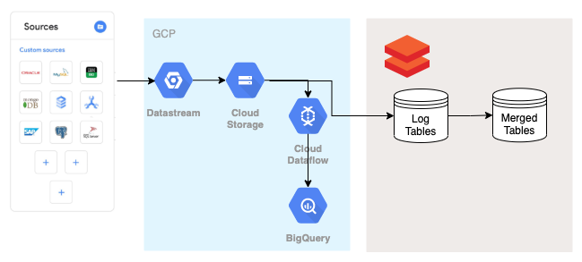
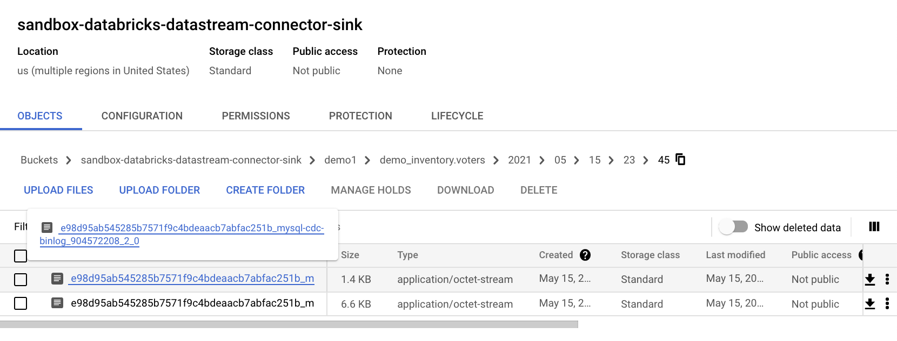
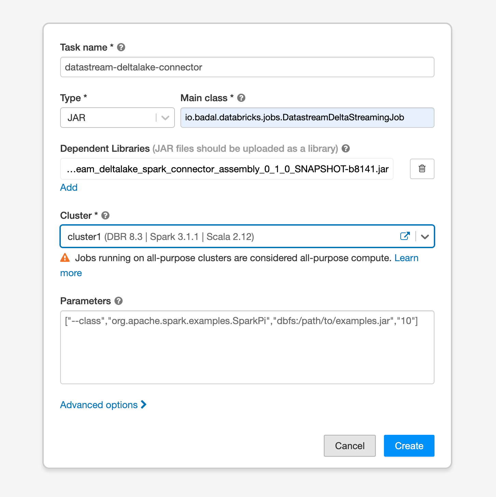

# Datastream Deltalake Connector

A Delta Lake connector for GCP [Datastream](https://cloud.google.com/datastream)

## Overview

[Datastream](https://cloud.google.com/datastream) is a GCP a Serverless  Change Data Capture (CDC). You setup and configure Datastream to monitor your databases, and it delivers all the changes (insert, update, and delete) in a semi-real time stream. 

[Delta Lake](https://docs.delta.io/latest/delta-intro.html) is an open source Spark library that provides ACID transactions, scalable metadata handling, and unifies streaming and batch data processing on top of Spark. 

Currently Datastream streams changes to files in Google Cloud Storage (GCS). The Delta Lake connector streams those files and writes the changes to Delta Lake in two forms
1. Change Log tables - contain every single change that was made in the source database since the replication started. Can be replayed to rebuild the state of the database in any given point in the past.
2. Merged tables - contain the most recent snapshot of the database.

 
## More About Datastream

- Supported Source Databases: Currently only MySQL and Oracle as supported. However other sources are on the roadmap. Ones avaiable, the can be integrated into this connector with a few lines of code
- Supported Sinks: Currently Datastream supports streaming data only to GCS. However, support for publishing messages directly to Pub/Sub in under development

## Running Delta Lake on GCP
GCP provides two ways to run spark: [DataProc](https://cloud.google.com/dataproc?utm_source=google&utm_medium=cpc&utm_campaign=na-CA-all-en-dr-skws-all-all-trial-e-dr-1009892&utm_content=text-ad-none-any-DEV_c-CRE_526598862388-ADGP_Desk%20%7C%20SKWS%20-%20EXA%20%7C%20Txt%20~%20Data%20Analytics%20~%20Dataproc_Data-KWID_43700061549686780-kwd-145280350857&utm_term=KW_dataproc-ST_dataproc&gclid=CjwKCAjwzt6LBhBeEiwAbPGOgRf2M925dmlFf3gRHA046NIAj9jnsVwIFH2xzF1W_VwG_cOE431AWRoCx6wQAvD_BwE&gclsrc=aw.ds) and [Databricks running on GCP](https://docs.gcp.databricks.com/)
In this guide we will be using Databricks. 

### Building Fat Jar for the Spark connector

`sbt "project spark-connector" clean assembly`

## Getting Started

### Setup Test Environment on GCP 

- Create a CloudSQL instance: https://cloud.google.com/sql/docs/mysql/create-instance
- Configure the CloudSQL instance to for Datastream: https://cloud.google.com/datastream/docs/configure-your-source-mysql-database
- Create a Datastream connection profile: https://cloud.google.com/datastream/docs/create-connection-profiles
- Create a Datastream stream: https://cloud.google.com/datastream/docs/create-a-stream

### Start Mock Data Generator

Follow instructions in  app-engine-mock-data-producer/ 

After a couple of minutes you should see files being writen 

### Setup Databricks on GCP

### Deploy Connector on Databricks 

* Deploy a new Databricks cluster with environment variables.
* Follow the instructions for building a fat jar for the connector
* In Databricks, define a new job of type JAR
  * main class is `io.badal.databricks.jobs.DatastreamDeltaStreamingJob`
  * add the fat jar as a dependent library
  * point to the databricks cluster with your configuration setup
* Run the job

## Running Locally 
#### Connecting to GCP Locally

You need to download gcloud command line tools
Download and set up gcloud sdk (https://cloud.google.com/sdk/docs/install) and executing the following commands through CLI:

`gcloud auth application-default login`

May need to set your project configuration to the relevant one also,

`gcloud config set project sandbox-databricks`

## Configuration

Configuration of the connector is achieved through a series of environment variables

| Configuration | Description | Default | Required
| --- | --- | --- | --- | 
| GENERATE_LOG_TABLE | flag to control whether not an intermediate delta table (change log table) will be generated. The table will have the suffix `_log` | true | no
| CHECKPOINT_DIR | Location of the structured streaming checkpoints (note should include protocol) | dbfs:/_checkpoint | no
| NAME | The name of the Spark application | datastream-deltalake-connector | no
| READ_FORMAT | The file format used by datastream.   Currently supports only avro / parquet / json (can be used but not actually supported by datastream) | avro | no
| FILE_READ_CONCURRENCY | The max number of files per table which can be read in a single batch | 2 | no
| DATASTREAM_TABLE_SOURCE_TYPE | A type flag used to distinguish between the different mechanisms for providing the Datastream tables to stream into Delta Currently supports two types `discovery-bucket` and `local-directory` | discovery-bucket | no
| BUCKET | The GCS bucket to be used if using the discovery-bucket type | None | yes (when type is `discovery-bucket`)
| SOURCE_PATH | When using `discovery-bucket` this optionally provides a path to a directory within the bucket to be used.   For `local-directory` this is a file path to the local directory where tables are located | None | yes (when type is `local-directory`)
| DELTA_TABLE_NAME_PREFIX | | None | no
| DELTA_MERGE_FREQUENCY_MINUTES | The microbatch duration of the job (how often changes will be merged into delta) | 1 | no
| DELTA_SCHEMA_EVOLUTION_STRATEGY | The strategy for dealing with schema changes. There are currently three types:   `mergeSchema` - attempts to use delta's pre-defined merge strategy   `overwriteSchema` - uses delta's overwrite schema option (will break backwards compatibility)   `none` - no strategy will be applied and schema changes will cause failures    https://databricks.com/blog/2019/09/24/diving-into-delta-lake-schema-enforcement-evolution.html | mergeSchema | no
| DELTA_TABLE_PATH | The location of the delta table data / log | dbfs:/_delta | no

## Limitations
1) Updating primary key columns has not been tested
2) source_metadata.is_deleted column is used to detect deletes, while the change_type column is ignored (similar to the Dataflow implimentation)
3) New Datastream tables are not auto-discovered. Ingesting newly added tables requires restating the connector